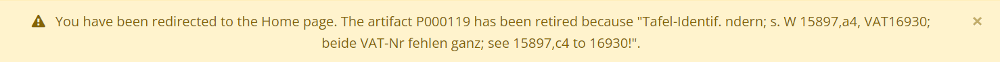

```
title: Retired Artifacts for Developers
section: Dev and devops docs
category: Features Guide
audiences:
  - Developer
chips:
  - developer
authors:
  - Angal, Shivoham
```
<h2>Retired Artifacts for Developers</h2>

When an artifact is retired it means that it is either permanently deleted or, if duplicate artifacts are found then we keep the old one and new one is retired.

The following list mentions the new features that were added to address the retired artifacts, along with the file and database changes -

1. First to get started, the tables being used for these functionalities are -
    * There are majorly three fields being used from the `artifacts` table, these are - `retired`, `redirect_artifact_id`, and `retired_comments`.
    * Then, from the `artifacts_updates` table we use the `redirect_artifact_id` and `retired_comments` fields.

2. For the next step, the entity files `Artifact.php` and `ArtifactsUpdate.php` are updated to address the newly added columns.

3. Then to make the index page, a route is added to the `routes.php` file as -

        $routes->connect('/artifacts/retired', ['controller'=> 'Artifacts', 'action' => 'retired']);
        

4. Then the code for the index page is added in `Admin/Artifacts/retired.php` in the templates folder, and a public function `retired()` is added to the `Admin/ArtifacsController.php` file. The index page can be viewed here - http://127.0.0.1:2354/admin/artifacts/retired

5. Next comes the redirect functionality where users linking to retired artifacts are redirected to the appropriate view. The logic for this can be found in the `ArtifacsController.php` file. It includes 2 cases -

    * If the artifact is deleted i.e., it doesn't have a redirect_artifact_id then the user is redirected to the home page.<br>
    e.g. If a user links to http://127.0.0.1:2354/artifacts/119, then they will be redirected to the home page with the following flash mesage:
    

    * If the artifact has a redirect_artifact_id then the user is redirected to the view of the artifact with that particular id.<br>
    e.g. If a user links to http://127.0.0.1:2354/artifacts/462, then they will be redirected the single view of the redirect_artifact_id - http://127.0.0.1:2354/artifacts/461 with the following flash message: <br>
    

    If there is no comment as to why the artifact was retired, then the flash mesage would just say "The artifact PXXXXXX has been retired."

6. Finally comes the retired section in the artifact edit form. Here, the 2 fields "Redirect Artifact ID" and "Retired Comments" were added under the "Is this artifact retired" toggle. These 2 new fields are always displayed in the form but are disabled if the artifact is not retired.<br>
 <br>
When toggle is on these 2 fields are no more disabled.  


    To retire an artifact, the toggle is switched on and the 2 fields are updated as necessary. Finally, the user can save these changes.
