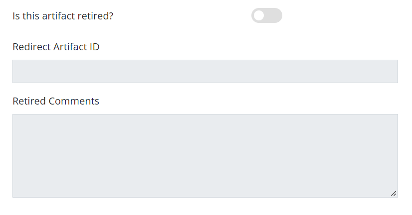
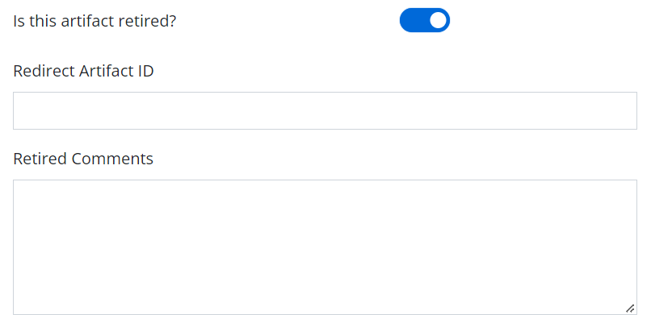

```
title: Retired Artifacts For Editors
section: User guides
category: Features Guide
audiences:
  - Content contributor
chips:
  - editor
authors:
  - Angal, Shivoham

```
<h2>Retired Artifacts for Editors</h2>

To retire or un-retired an artifacts you will need to visit the artifact edit form. The link for the same is like https://cdli.ucla.edu/artifacts/edit/1. You can add the the id of the artifact you want to edit in place of '1' in the link.

1. When you visit the edit form of an artifact that is not yet retired and scroll down a bit, the retired section will look something like this -
 <br>
Here, the toggle is off and hence the fields are disabled. When the toggle is clicked, the two fields will be enabled as in the image below, and you can enter the values that you want. <br>


Then finally, when you hit the save button, you will be redirected to artifacts-updates/add view for the changes you made. Here you can confirm your changes or discard them.

2. To un-retire an artifact you simply need to turn off the toggle and the artifact will be un-retired. Rest of the process is same as above.

3. Whenever an artifact is retired, it will not appear in search results.

4. Also, when you link to the single view of a retired artifact(e.g. https://cdli.ucla.edu/artifacts/462) you will be redirected to the home page if that artifact doens't have a redirect_artifact_id. If it has one, you will be redirected to the single view of the artifact with that particular id.

5. The flash message after linking to the single view of artifact P0000462(a retired artifact) would look like this <br>
 
 